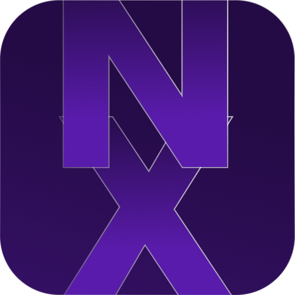

# NoteX - Aplicativo de Notas

## Sobre o NoteX

NoteX é um aplicativo de notas simples e elegante desenvolvido usando o framework Flet para Python. Ele oferece as seguintes funcionalidades:

- Sistema de login e registro de usuários
- Armazenamento local de dados do usuário para manter a sessão ativa
- Visualização e gerenciamento de notas
- Interface de usuário escura para conforto visual

O aplicativo é estruturado em várias páginas, incluindo:
- Página de login
- Página de registro
- Página de visualização de notas
- Página de detalhes da nota

## Como instalar

Para instalar e executar o NoteX, siga estas etapas:

1. Certifique-se de ter o Python instalado em seu sistema (versão 3.7 ou superior).

2. Instale o Flet usando pip:
   ```
   pip install flet
   ```

3. Clone o repositório do NoteX :
   ```
   git clone https://github.com/VS-7/notex_mobile_app.git
   cd notex
   ```

4. Execute o aplicativo:
   ```
   flet run main.py
   ```

O aplicativo será iniciado e você poderá visualiza-lo, caso todas as depêndencias tenham sido instaladas.

## Requisitos

- Python 3.7+
- Flet

## Estrutura do Projeto

O projeto é composto por vários arquivos:

- `main.py`: O ponto de entrada do aplicativo, contendo a lógica principal.
- `pages/login_view.py`: Implementação da página de login.
- `pages/register_view.py`: Implementação da página de registro.
- `pages/notes_view.py`: Implementação da página de visualização de notas.
- `pages/note_detail_view.py`: Implementação da página de detalhes da nota.

## Contribuindo

Contribuições são bem-vindas! Por favor, sinta-se à vontade para enviar pull requests ou abrir issues para melhorias ou correções de bugs.
